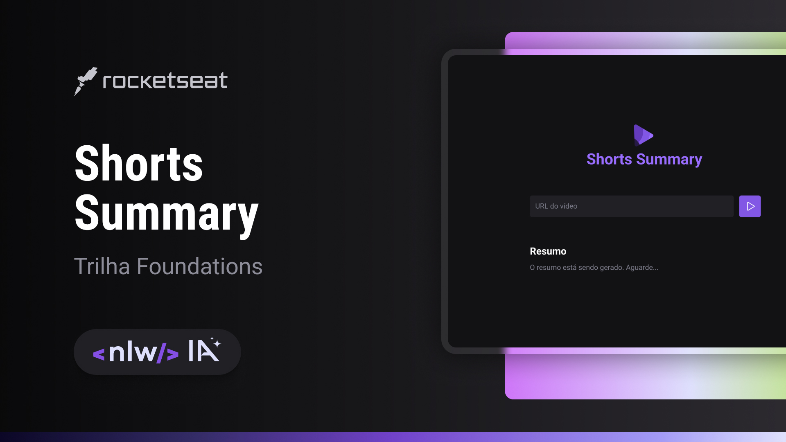

<h1> Shorts Summary </h1>

  

## 🚀 Tecnologias

- HTML/CSS/Javascript
- Frameworks: axios - cors - express
- Esse projeto utiliza modelos de linguagem de IA, disponíveis em https://huggingface.co/models

## 💻 Projeto

O Shorts Summary é uma aplicação web que busca um short do YouTube, faz o download do vídeo, transcreve o áudio e finalmente resume o texto final usando Inteligência Artificial.
